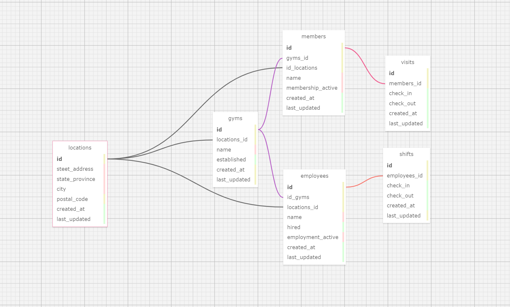

## Work Out Gym Management API

### Created By David Couch 8/17/2021

## About

This is an application made to create a database which holds locations, gyms, members, employees, visits, and shifts.

- `locations`: Locations will be stored for gyms, members and employees.
- `gyms`: This will be the gym that will have members, and employees.
- `members`: Members will have visits.
    - `visits`: this will when the user signs in and signs out.
- `employees`: employees will have shifts.
    - `shifts`: this will be for when the employee clocks in ands clocks out.
## Tech Used
- Ruby
- Rails
- PG
- Rspec Rails
- Faker
- Shoulda Matchers
- Factory Bot Rails

#### `Schema`


### Goals
- minimum queries per route visit.
  
### Routes

```
GET    /v1/gyms/:gym_id/members              v1/members#index
POST   /v1/gyms/:gym_id/members              v1/members#create
GET    /v1/gyms/:gym_id/members/:id          v1/members#show
PATCH  /v1/gyms/:gym_id/members/:id          v1/members#update
PUT    /v1/gyms/:gym_id/members/:id          v1/members#update
DELETE /v1/gyms/:gym_id/members/:id          v1/members#destroy
GET    /v1/gyms/:gym_id/employees            v1/employees#index
POST   /v1/gyms/:gym_id/employees            v1/employees#create
GET    /v1/gyms/:gym_id/employees/:id        v1/employees#show
PATCH  /v1/gyms/:gym_id/employees/:id        v1/employees#update
PUT    /v1/gyms/:gym_id/employees/:id        v1/employees#update
DELETE /v1/gyms/:gym_id/employees/:id        v1/employees#destroy
GET    /v1/gyms                              v1/gyms#index
POST   /v1/gyms                              v1/gyms#create
GET    /v1/gyms/:id                          v1/gyms#show
PATCH  /v1/gyms/:id                          v1/gyms#update
PUT    /v1/gyms/:id                          v1/gyms#update
DELETE /v1/gyms/:id                          v1/gyms#destroy
GET    /v1/members/:member_id/visits         v1/visits#index
GET    /v1/members/:member_id/visits/:id     v1/visits#show
PATCH  /v1/members/:member_id/visits/:id     v1/visits#update
PUT    /v1/members/:member_id/visits/:id     v1/visits#update
POST   /v1/members/:member_id/visits         v1/visits#status
GET    /v1/members                           v1/members#index
POST   /v1/members                           v1/members#create
GET    /v1/members/:id                       v1/members#show
GET    /v1/employees/:employee_id/shifts     v1/shifts#index
GET    /v1/employees/:employee_id/shifts/:id v1/shifts#show
PATCH  /v1/employees/:employee_id/shifts/:id v1/shifts#update
PUT    /v1/employees/:employee_id/shifts/:id v1/shifts#update
POST   /v1/employees/:employee_id/shifts     v1/shifts#status
GET    /v1/employees                         v1/employees#index
GET    /v1/employees/:id                     v1/employees#show
PATCH  /v1/employees/:id                     v1/employees#update
PUT    /v1/employees/:id                     v1/employees#update
```

## `Install & Run on your machine  :`
***
* These instructions assume you have ruby, rails, & postgres installed
* Install [Ruby and Rails](https://www.learnhowtoprogram.com/ruby-and-rails/getting-started-with-ruby/installing-ruby)
* Install [PostgreSQL](https://www.learnhowtoprogram.com/ruby-and-rails/getting-started-with-ruby/installing-postgres)
***

* Go to ( https://github.com/dcouch440/rails_workout_api ).

*  Navigate to the code button on the Github website.

* Click on the code button to open the menu.

- Copy the HTTPS code by clicking the clipboard next to the link.

- Within your Bash terminal navigate to your desired location by using cd fallowed by your desired directory.

```bash
 cd Desktop
```

- Once you have chosen your desired directory use the command.

```bash
git clone https://github.com/dcouch440/rails_workout_api.git
```

<div
  style="
    background-color: #d1ecf1;
    color: grey; padding: 6px;
    font-size: 9px;
    border-radius: 5px;
    border: 1px solid #d4ecf1;
    margin-bottom: 12px"
>
  <span
    style="
      font-size: 12px;
      font-weight: 600;
      color: #0c5460;"
  >
    ⓘ
  </span>
  <span
    style="
      font-size: 12px;
      font-weight: 900;
      color: #0c5460;
      margin-bottom: 24px"
  >
    Note :
  </span>
  If you have any problems make sure your HTTPS code is correct! The example above might not be the most recent HTTPS code!
</div>
  
* Then after the process is completed use the command.
```
  cd (the file name that you saved it as)
```

* now open the project with ( code is the code name for vs code )

``` bash
code .
```

For windows users navigate to the database.yml file to set your username and password.

```
Setup postgresql for rails

	📁 config > 📑 database.yml
        default: &default
          adapter: postgresql ✔️
          encoding: unicode
          pool: <%= ENV.fetch("RAILS_MAX_THREADS") { 5 } %>
          username: (username here) ✔️
          password: (password here) ✔️

```
* If you wish to keep these private you can also use a credentials password or an ENV file

* Note : we use <%= %> inside the database file because we are not within a ruby file.

### `Credentials`
* See this link to learn how to do so. ( https://www.youtube.com/watch?v=BHgvPPr2nLE )

* Start off by deleting your credentials.yml.enc file and master.key (within config folder) in order to generate another

```
  For vs code users try (within the terminal)
  EDITOR="code --wait" rails credentials:edit
```

* Within the file add then close the file to save

```
  pg_database_username: add username here
  pg_database_password: add password here
```

* Then inside the database.yml (see description above) add (or uncomment)

```
  username: <%= Rails.application.credentials.pg_database_username %>
  password: <%= Rails.application.credentials.pg_database_password %>
```

* Thats all for credentials

### `ENV`
* start by adding the gem
```
gem 'dotenv-rails'
```

* add a .env file to your main directory

```
touch .env
```

* within your file add your key and value (no quotes)

```
FIRST_VALUE_NAME='FIRST_VALUE'
SECOND_VALUE_NAME='SECOND_VALUE'
```

* Then from within your files you can call on these files as such

```
  username: <%= ENV['PG_USERNAME'] %>
  password: <%= ENV['PG_PASSWORD'] %>
```

* Thats all for .env files

* Within the main directory of the project create your databases with

```
rails db:create
```

```
rails db:migrate
```

* From here to start the server you will need to type in:

```
  rails s
```

* visit localhost:3000 to view the app